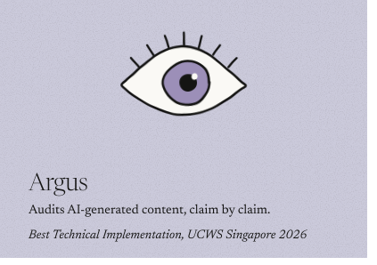
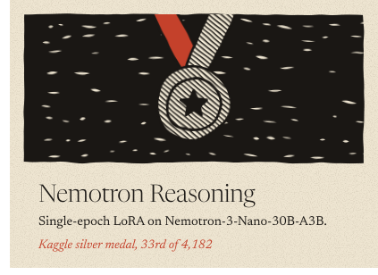
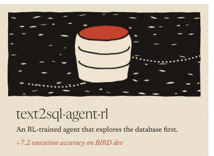
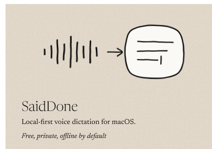
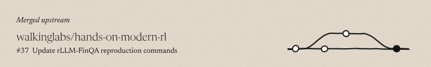

 

<a href="https://chaoqiluo.com/"><picture><source media="(prefers-color-scheme: dark)" srcset="assets/link-website-dark.svg"></picture></a> <a href="https://scholar.google.com/citations?user=eOwS19sAAAAJ&hl=en"><picture><source media="(prefers-color-scheme: dark)" srcset="assets/link-scholar-dark.svg"></picture></a> <a href="https://www.linkedin.com/in/chaoqi-luo-4317bb2b7/"><picture><source media="(prefers-color-scheme: dark)" srcset="assets/link-linkedin-dark.svg"></picture></a> <a href="mailto:luo31@seas.upenn.edu"><picture><source media="(prefers-color-scheme: dark)" srcset="assets/link-email-dark.svg"></picture></a>

