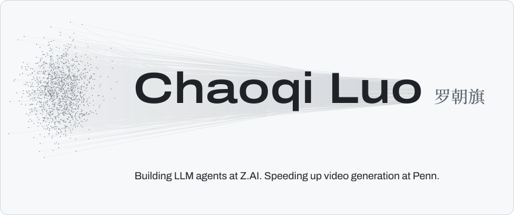
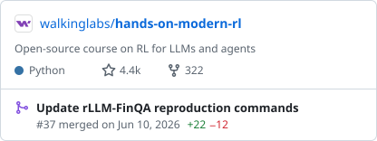

<picture><source media="(prefers-color-scheme: dark)" srcset="assets/hero-dark.svg"></picture>

I'm an M.S. student in Electrical Engineering (AI track) at the University of Pennsylvania. At [Zhipu AI (Z.AI)](https://www.zhipuai.cn/en/about) I'm a research engineer intern, building the runtime, tools, and context management behind LLM agents. At Penn I'm a research intern in [Jiatao Gu](https://jiataogu.me/)'s group, where we speed up autoregressive video generation with few-step flow distillation.

More on [my website](https://chaoqiluo.com/), [Google Scholar](https://scholar.google.com/citations?user=eOwS19sAAAAJ&hl=en), and [LinkedIn](https://www.linkedin.com/in/chaoqi-luo-4317bb2b7/), or email [luo31@seas.upenn.edu](mailto:luo31@seas.upenn.edu).

### Open-source contributions

<!-- contributions:start -->
<a href="https://github.com/walkinglabs/hands-on-modern-rl/pull/37"><picture><source media="(prefers-color-scheme: dark)" srcset="assets/contrib/walkinglabs-hands-on-modern-rl-dark.svg"></picture></a>
<!-- contributions:end -->

### Selected work

- **[Argus](https://argus-truth-engine.vercel.app)** is an audit layer for AI-generated content. It checks each claim with deep research and links every verdict to its reasoning trail. Best Technical Implementation at the UCWS Singapore 2026 × MiroMind Deep Research hackathon. ([code](https://github.com/Chaoqi31/argus-truth-engine))
- **[NVIDIA Nemotron Model Reasoning Challenge](https://www.kaggle.com/competitions/nvidia-nemotron-model-reasoning-challenge)**. Kaggle silver medal, 33rd of 4,182, with a single-epoch LoRA fine-tune of Nemotron-3-Nano-30B-A3B. ([code](https://github.com/Chaoqi31/nemotron-reasoning-lora))
- **[text2sql-agent-rl](https://github.com/Chaoqi31/text2sql-agent-rl)** trains Qwen3.5-9B with GRPO to explore a database with tools before it answers. RL adds 7.2 points of execution accuracy on BIRD dev.
- **[SaidDone](https://github.com/Chaoqi31/saiddone)** is free, local-first voice dictation for macOS. Press a hotkey, speak, and polished text appears at your cursor.
